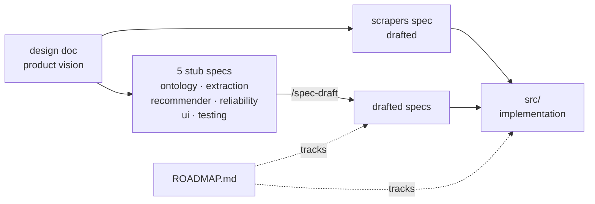
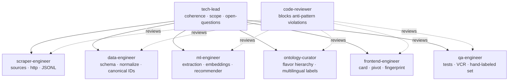
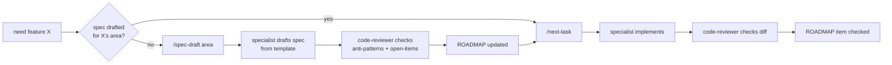

# tea-db

A Claude Code workspace scaffolded to act like a team of developers building the tea recommendation engine described in `tea_rec_engine_design_v2.md`. No implementation code yet — the team's first job is to draft the missing specs and then build against them.

## What's in the box

| Path | Purpose |
|---|---|
| `tea_rec_engine_design_v2.md` | Product vision (the apex doc) |
| `specs/tea_scrapers_v1_spec.md` | The one complete implementation spec — also the shape every other spec copies |
| `specs/spec-template.md` | Canonical 11-section spec shape |
| `specs/tea_*_v1_spec.md` | Six stub specs awaiting drafts (ontology, extraction, recommender, reliability, ui, testing) |
| `CLAUDE.md` | Orientation Claude reads at session start |
| `ROADMAP.md` | Checklist tracking specs + implementation |
| `.claude/agents/` | Eight role-based subagents |
| `.claude/commands/` | Five slash commands (`/standup`, `/next-task`, `/open-questions`, `/spec-check`, `/spec-draft`) |
| `.claude/settings.json` | Pre-allowed read-only bash commands |

## How the artifacts relate

The design doc is the only doc that pre-exists in full. The scrapers spec is the only implementation spec that's complete. Everything else cascades from those two, mediated by the team.

## Who does what

Each specialist owns both the **spec** and the **implementation** in their domain. tech-lead arbitrates cross-cutting decisions. code-reviewer is invoked proactively after non-trivial work.

## How a feature gets built

The hard rule: **no implementation in an area before that area's spec is drafted.** A spec without populated Anti-Patterns and Open Items sections is incomplete and will be flagged by code-reviewer.

## First steps for a new session

1. Open in Claude Code at this directory. `CLAUDE.md` loads automatically.
2. Run `/standup` to see what's done, in flight, and blocked.
3. Run `/next-task` to pick up the next item. Early on, the answer will be a `SPEC:` task — drafting one of the six stub specs.
4. When `/next-task` proposes delegating to a specialist, accept; the specialist agent has the full domain context baked into its prompt.

## House rules

- **Design doc wins** over intuition. **Scrapers spec wins** over generic best practice (it was deliberately authored to override generic patterns — see its §11).
- **Spec before code** in any area. Stubs in `specs/` make the gap visible.
- **Quote-evidence on every badge** is non-negotiable (design §4, §6 #1). It's what makes the product trustworthy.
- **Open questions get tracked**, not silently resolved. Use `/open-questions` to see the live list.
- **`/spec-check`** is the audit pass against design-doc principles and scraper anti-patterns. Run it before declaring a milestone done.
